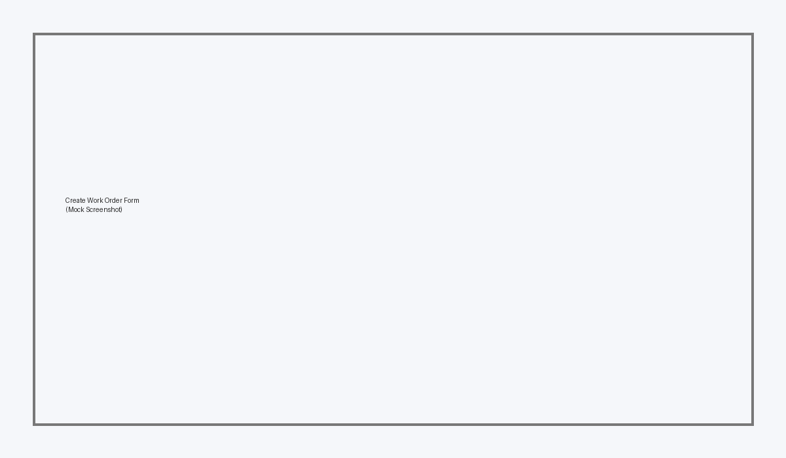
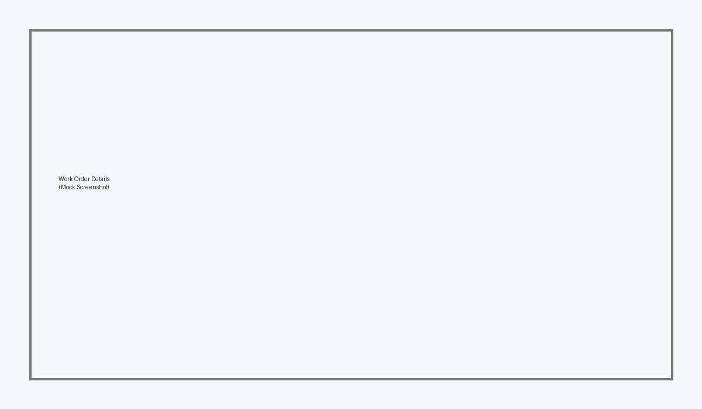

# React-API Portal 🚀
**Enterprise-Style React Application (Mock Backend + Docker)**

React-API Portal is a **business-grade React application** designed to demonstrate how modern enterprise front-end systems are built.  
It simulates a real Work Order Management System using **React, TypeScript, MSW (Mock API), and Docker**.

This project is ideal for:
- Interviews
- Architecture walkthroughs
- React enterprise pattern demonstrations
- Backend–frontend integration discussions

---

## 🔧 Tech Stack

### Frontend
- **React 18 + TypeScript**
- **Vite** (fast dev server & build)
- **Material UI (MUI)** – enterprise UI components
- **React Router** – routing & protected routes
- **React Hook Form + Zod** – form handling & validation
- **TanStack React Query** – server-state caching
- **Zustand** – UI state management

### API & Architecture
- **Axios** – API client with interceptors
- **MSW (Mock Service Worker)** – mock backend (no real server required)
- **JWT-style Auth (mocked)** – role-based access

### DevOps
- **Docker**
- **Docker Compose**

---

## 👥 User Roles (Mocked)

| Role | Permissions |
|----|----|
| TECH | View work orders |
| SUPERVISOR | View + Close OPEN work orders |
| ADMIN | Full access + Admin page |

Login is mocked – email determines role:
- `tech@demo.com`
- `sup@demo.com`
- `admin@demo.com`

---

## 📂 Application Features

### ✅ Authentication & Authorization
- Login with token storage
- Protected routes
- Role-based UI rendering
- Route-level role enforcement

### ✅ Work Orders Module
- List work orders (table + filters)
- Search + status filtering
- Create work order (validated form)
- View details
- Close work order (role + status based)

### ✅ State Management
- **Server State** → React Query
- **UI State** → Zustand
- **Auth State** → React Context

### ✅ Performance Patterns
- Memoized table rows
- Debounced search input
- Minimal re-renders

---

## 🌐 Routes

| Route | Description |
|----|----|
| `/login` | Login page |
| `/work-orders` | Work order list |
| `/work-orders/new` | Create work order |
| `/work-orders/:id` | Work order details |
| `/assets` | Assets page |
| `/admin` | Admin-only page |

---

## 🔌 Mock API (MSW)

The backend is fully mocked using **MSW**.

### Endpoints
- `POST /api/auth/login`
- `GET /api/work-orders`
- `GET /api/work-orders/:id`
- `POST /api/work-orders`
- `PUT /api/work-orders/:id/status`

This allows the UI to behave exactly like a real backend-driven system.

---

## ▶ Run Locally (Node)

```bash
npm install
npx msw init public/ --save
npm run dev
```

Open:
```
http://localhost:5173
```

---

## 🐳 Run with Docker (Recommended)

Make sure **Docker Desktop** is running.

```bash
docker compose up --build
```

Open:
```
http://localhost:5173
```

---

## 🧠 Interview Talking Points

You can confidently explain:
- Separation of **server state vs UI state**
- Role-based UI enforcement + backend enforcement concept
- Feature-based folder structure
- Mock-first API development
- How this app can scale to a real backend (Spring Boot, Node, etc.)

> “This project mirrors how enterprise React applications are built, including auth, caching, modular features, and deployment with Docker.”

---

## 🔮 Possible Extensions
- Pagination & server-side filtering
- Audit logs per work order
- Real backend (Spring Boot / Node)
- WebSockets for real-time updates
- CI/CD pipeline

---

## 📌 Author
Built as an **enterprise React reference project** for real-world applications and interviews.

---

## 🖼 Screenshots

### Login


### Work Orders List


### Create Work Order


### Work Order Details


### Admin Page


